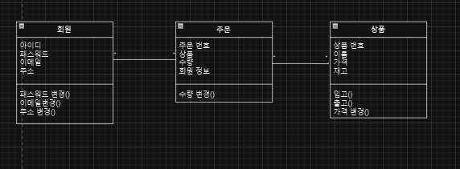
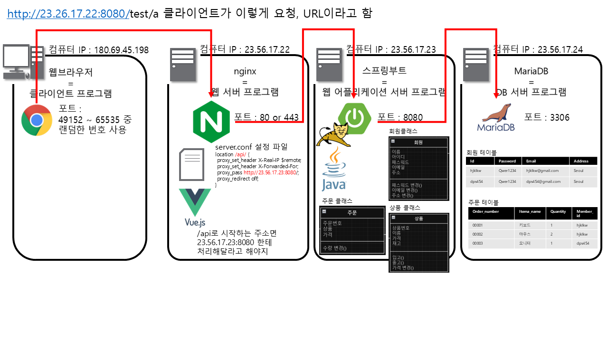

## 💡 연습 프로젝트
yeon7485가 추가함

## 📍프로젝트 목표
동휘가 추가 함 희희 

## 🖥️ 프로젝트 선정 이유
김혜정이 추가함

## 🚥운영 환경

* Ubuntu 24.04 Server
* k8s
* Spring & Springboot
* blah blah blah

황경윤이 추가함

- 회원
	- 회원가입
    - 로그인
    - 로그아웃
    - 회원 탈퇴
    - 소셜 로그인
    - 이메일 인증 

- 상품 
	- 상품 등록
    - 상품 조회
    - 상품 삭제
    - 상품 수정 

- 주문 
	- 주문 생성
    - 주문 취소
    - 결제
    - 주문 변경
## 클래스 다이어 그램 

